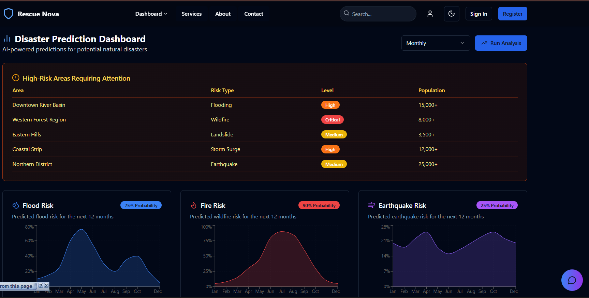
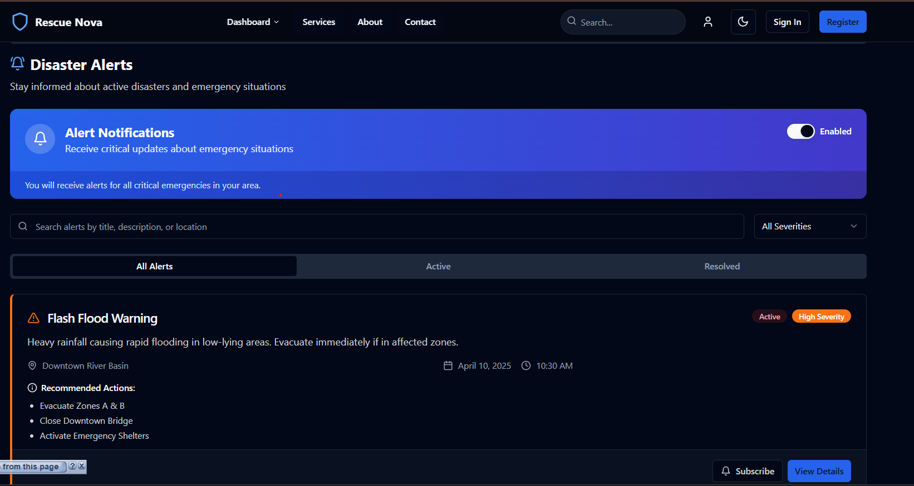
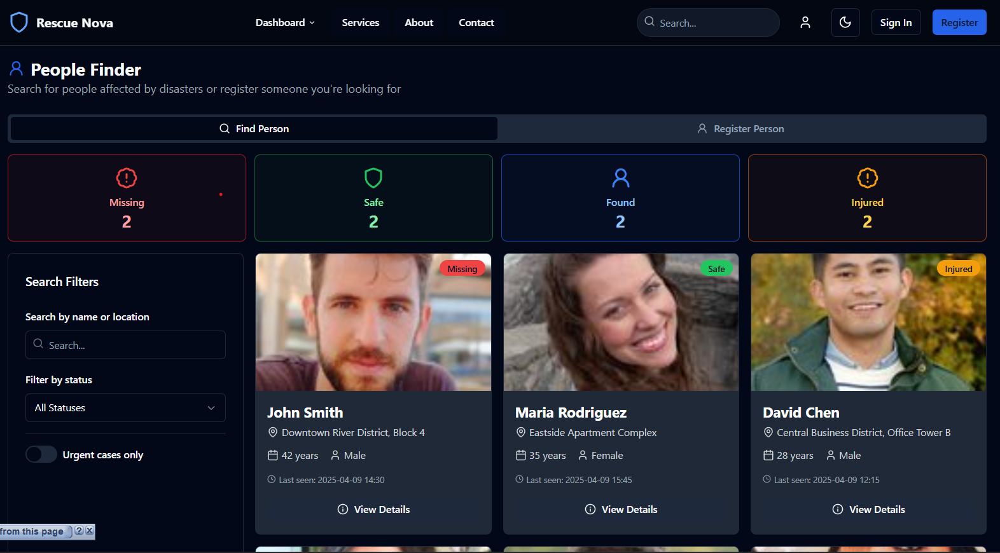
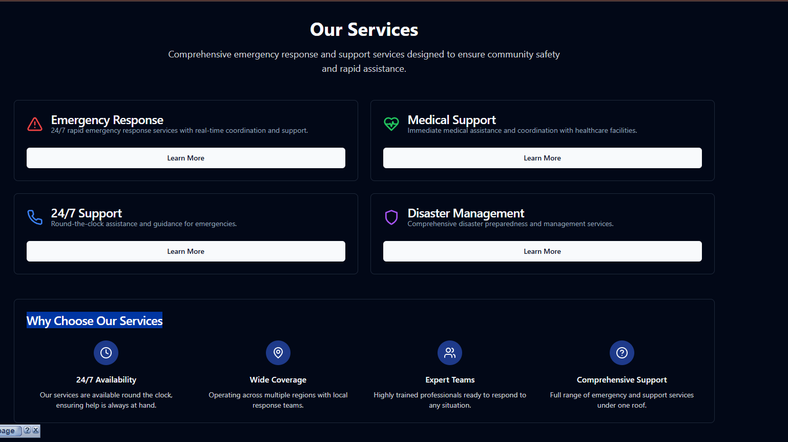

# Rescue Nova - Emergency Response Platform 🚨

[](https://opensource.org/licenses/MIT)
[](https://reactjs.org/)
[](https://www.typescriptlang.org/)
[](https://vitejs.dev/)
[](https://tailwindcss.com/)

Rescue Nova is a cutting-edge emergency response platform that harnesses the power of AI to deliver intelligent assistance during critical situations. Our platform seamlessly integrates real-time alerts, emergency response coordination, and an AI-powered chatbot for immediate assistance.



## ✨ Features

- 🤖 **AI-Powered Assistant** - Advanced chatbot powered by Llama 3 for immediate emergency guidance
- 🚨 **Real-time Alerts** - Instant emergency notifications and updates
- 👥 **Person Finder System** - Efficient tool for locating missing persons during emergencies
- 📊 **Prediction Dashboard** - AI-driven emergency prediction and resource allocation
- 🌙 **Dark Mode** - Eye-friendly interface for 24/7 operations
- 🔒 **Secure Authentication** - Role-based access control
- 🏥 **Emergency Services Directory** - Comprehensive database of emergency resources
- 📱 **Responsive Design** - Seamless experience across all devices

## 🛠️ Tech Stack

- **Frontend Framework**: React 18 + TypeScript
- **Build Tool**: Vite
- **Styling**: Tailwind CSS + Shadcn UI
- **Animations**: Framer Motion
- **State Management**: React Query
- **Form Handling**: React Hook Form + Zod
- **AI Integration**: Groq API (Llama 3)
- **API Integration**: Axios

## 🚀 Quick Start

### Prerequisites

- Node.js (v18 or higher)
- npm or yarn
- Groq API key

### Installation

1. Clone the repository:
   ```bash
   git clone https://github.com/Cryptonomicon-Manish-dev/rescue-nova.git
   cd rescue-nova
   ```

2. Install dependencies:
   ```bash
   npm install
   # or
   yarn install
   ```

3. Configure environment variables:
   - Copy `.env.example` to `.env`
   - Add your API keys:
     ```
     VITE_GROQ_API_KEY=your_groq_api_key_here
     ```

4. Start the development server:
   ```bash
   npm run dev
   # or
   yarn dev
   ```

Visit `http://localhost:5173` in your browser.

## 📸 Screenshots

### Dashboard

*Real-time emergency monitoring and response coordination*

### Alerts System

*Instant emergency notifications and status updates*

### Person Finder

*Efficient missing person search and location system*

### Emergency Services

*Comprehensive emergency services directory*

## 🗂️ Project Structure

```
rescue-nova/
├── src/
│   ├── components/     # Reusable UI components
│   ├── pages/         # Page components
│   ├── lib/           # Utility functions
│   ├── hooks/         # Custom React hooks
│   ├── config/        # Configuration files
│   └── styles/        # Global styles
├── public/            # Static assets
└── package.json       # Project dependencies
```

## ⚡ Performance

- 🎯 Lighthouse Score: 95+
- ⚡ Initial Load Time: < 2s
- 📱 Mobile-First Design
- 🔍 SEO Optimized

## 🔒 Security Features

- 🔐 Role-based Authentication
- 📝 Audit Logging
- 🔒 Data Encryption
- 🛡️ DDOS Protection
- 🚫 Rate Limiting

## 🔧 Configuration

The platform can be configured through environment variables:

```env
VITE_GROQ_API_KEY=     # Groq API key for AI features
VITE_API_URL=          # Backend API URL
VITE_WS_URL=          # WebSocket URL for real-time features
```

## 🤝 Contributing

1. Fork the repository
2. Create your feature branch: `git checkout -b feature/amazing-feature`
3. Commit your changes: `git commit -m 'Add amazing feature'`
4. Push to the branch: `git push origin feature/amazing-feature`
5. Open a Pull Request

## ⚠️ Limitations

- AI responses may require internet connectivity
- Real-time features depend on WebSocket connection
- Some features may require specific browser permissions
- Mobile app features may vary by device

## 📄 License

This project is licensed under the MIT License - see the [LICENSE](LICENSE) file for details.

## 🙏 Acknowledgments

- [Shadcn/ui](https://ui.shadcn.com/) for the beautiful UI components
- [Groq](https://groq.com/) for the AI API
- [Framer Motion](https://www.framer.com/motion/) for animations

## 📞 Support

For support, email support@rescuenova.com or join our [Discord community](https://discord.gg/rescuenova).

---
Made with ❤️ by the Rescue Nova Team
